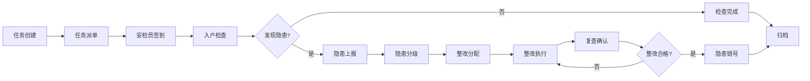

## 1. 产品概述

城市燃气安全巡检 Web 应用是一个供燃气公司、街道和第三方安检员协同使用的综合管理平台，旨在提升城市燃气安全巡检效率，实现隐患闭环管理，保障居民用气安全。

- **核心目标**：通过数字化手段实现燃气巡检全流程管理，提升安检覆盖率，降低安全隐患
- **目标用户**：燃气公司管理人员、街道工作人员、第三方安检员
- **市场价值**：助力城市燃气安全监管数字化转型，减少燃气安全事故

## 2. 核心功能

### 2.1 用户角色

| 角色 | 注册方式 | 核心权限 |
|------|----------|----------|
| 燃气公司管理员 | 系统创建 | 全局数据查看、任务派单、隐患审核、报表生成 |
| 街道工作人员 | 系统创建 | 本街道数据查看、隐患跟踪、协调整改 |
| 第三方安检员 | 系统创建 | 任务执行、入户检查、隐患上报、签到打卡 |

### 2.2 功能模块

1. **总览页**：小区安检覆盖率、逾期户数、隐患等级分布、整改进度统计
2. **地图页**：楼栋管线、阀井、调压箱、高风险住户可视化展示
3. **任务页**：批量派单、改期、转派、签到、拍照留痕
4. **入户检查页**：表具读数、软管状态、报警器、通风条件、用户签字
5. **隐患页**：隐患分级、复查、销号、超期提醒
6. **工单页**：泄漏报修、停气通知、抢修进展、回访记录
7. **报表页**：街道、网格、安检员多维度统计报表

### 2.3 页面详情

| 页面名称 | 模块名称 | 功能描述 |
|----------|----------|----------|
| 总览页 | 数据概览卡片 | 展示安检覆盖率、逾期户数、待整改隐患、本月完成任务数 |
| 总览页 | 隐患等级分布 | 饼图展示一般隐患、较大隐患、重大隐患占比 |
| 总览页 | 整改进度趋势 | 折线图展示近30天隐患整改完成趋势 |
| 总览页 | 街道排名 | 表格展示各街道安检覆盖率排名 |
| 地图页 | 地图控件 | 缩放、平移、图层切换、搜索定位 |
| 地图页 | 设施图层 | 管线、阀井、调压箱位置展示及详情查看 |
| 地图页 | 住户图层 | 高风险住户标记，点击查看住户详情和隐患信息 |
| 地图页 | 楼栋信息 | 点击楼栋显示基本信息、安检状态、隐患统计 |
| 任务页 | 任务列表 | 按状态筛选（待执行、进行中、已完成、已逾期） |
| 任务页 | 批量操作 | 批量派单、批量改期、批量转派 |
| 任务页 | 任务详情 | 任务信息、住户信息、历史检查记录 |
| 任务页 | 签到打卡 | GPS定位签到，支持拍照留痕 |
| 入户检查页 | 基本信息 | 住户信息、安检员信息、检查时间 |
| 入户检查页 | 检查表单项 | 表具读数、软管状态、报警器状态、通风条件、其他隐患 |
| 入户检查页 | 拍照上传 | 现场照片拍摄和上传 |
| 入户检查页 | 用户签字 | 电子签名确认 |
| 隐患页 | 隐患列表 | 按等级、状态、时间筛选 |
| 隐患页 | 隐患详情 | 隐患描述、照片、整改要求、复查记录 |
| 隐患页 | 整改操作 | 分配整改人、设置整改期限、提交整改方案 |
| 隐患页 | 复查销号 | 复查结果录入、隐患销号、超期提醒 |
| 工单页 | 工单列表 | 泄漏报修、停气通知、抢修工单分类展示 |
| 工单页 | 工单处理 | 接单、派单、进度更新、完工确认 |
| 工单页 | 抢修进展 | 实时更新抢修状态、位置、人员信息 |
| 工单页 | 回访记录 | 用户满意度、问题反馈、回访时间 |
| 报表页 | 统计维度选择 | 街道、网格、安检员维度切换 |
| 报表页 | 数据图表 | 柱状图、折线图、饼图多维度展示 |
| 报表页 | 数据导出 | Excel/PDF格式报表导出 |
| 报表页 | 自定义时间 | 选择统计时间范围 |

## 3. 核心流程

### 主要业务流程描述

安检任务创建 → 任务派单给安检员 → 安检员签到 → 入户检查并记录信息 → 发现隐患上报 → 隐患整改分配 → 整改完成复查 → 隐患销号归档

## 4. 用户界面设计

### 4.1 设计风格

- **主色调**：深蓝色 (#1e3a8a) - 代表专业、安全、可信赖
- **辅助色**：橙色 (#f97316) - 用于预警、强调操作
- **成功色**：绿色 (#10b981) - 表示安全、完成
- **警告色**：红色 (#ef4444) - 表示危险、紧急
- **中性色**：深灰 (#1f2937)、中灰 (#6b7280)、浅灰 (#f3f4f6)
- **按钮风格**：圆角 8px，悬浮有阴影和轻微放大效果
- **字体**：系统无衬线字体，标题使用半粗体，正文使用常规字重
- **布局风格**：卡片式布局，顶部导航 + 侧边栏，内容区留白充足
- **图标风格**：线性图标，统一 24px 尺寸，颜色与文字一致

### 4.2 页面设计概览

| 页面名称 | 模块名称 | UI 元素 |
|----------|----------|---------|
| 总览页 | 数据概览卡片 | 圆角卡片、渐变背景、数据动画计数、图标装饰 |
| 总览页 | 图表区域 | 响应式图表、悬浮提示、图例可点击筛选 |
| 总览页 | 排名表格 | 斑马纹行、悬停高亮、排名徽章 |
| 地图页 | 地图容器 | 全屏地图、自定义标记点、信息弹窗 |
| 地图页 | 侧边面板 | 图层切换控件、设施列表、搜索框 |
| 任务页 | 筛选栏 | 标签页切换、下拉筛选、日期选择器 |
| 任务页 | 任务卡片 | 状态标签、优先级标识、操作按钮组 |
| 入户检查页 | 表单区域 | 分组表单、必填项标记、实时验证 |
| 入户检查页 | 签名区域 | 画布签名、清除按钮、确认按钮 |
| 隐患页 | 隐患列表 | 等级颜色标识、进度条、超时警告 |
| 报表页 | 统计看板 | 多图表布局、维度切换标签、导出按钮 |

### 4.3 响应式设计

- 采用桌面优先设计，适配 1366px 及以上分辨率
- 侧边栏在平板设备可折叠收起
- 表格在小屏幕转为卡片式展示
- 地图控件适配触摸操作

### 4.4 交互效果

- 页面加载时数据卡片渐入显示，数字计数动画
- 图表数据点悬浮显示详细信息
- 地图标记点击弹出信息窗，带平滑过渡
- 表单输入实时验证，错误提示友好
- 按钮点击有反馈动画，操作成功有消息提示
