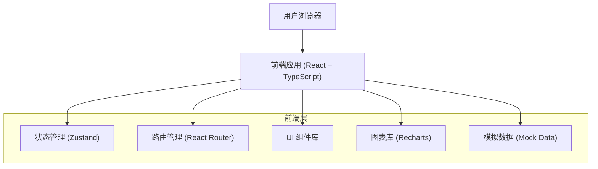

## 1. 架构设计



## 2. 技术描述

- **前端框架**: React@18 + TypeScript
- **构建工具**: Vite
- **样式方案**: TailwindCSS@3
- **路由管理**: React Router DOM
- **状态管理**: Zustand
- **图表库**: Recharts
- **图标库**: Lucide React
- **地图组件**: 使用 Leaflet 或自定义 SVG 地图
- **后端**: 无后端，使用模拟数据 (Mock Data)
- **数据存储**: 前端内存存储 + LocalStorage 持久化

## 3. 路由定义

| 路由 | 页面名称 | 用途 |
|------|----------|------|
| / | 总览页 | 数据概览、统计图表、排名展示 |
| /map | 地图页 | 设施地图、楼栋信息、高风险住户展示 |
| /tasks | 任务页 | 任务列表、批量操作、签到打卡 |
| /inspection/:id | 入户检查页 | 检查表单、拍照上传、用户签字 |
| /hazards | 隐患页 | 隐患列表、整改管理、复查销号 |
| /workorders | 工单页 | 报修工单、抢修进展、回访记录 |
| /reports | 报表页 | 多维度统计、数据导出 |

## 4. 数据模型

### 4.1 核心数据类型定义

```typescript
// 用户信息
interface User {
  id: string;
  name: string;
  role: 'admin' | 'street' | 'inspector';
  phone: string;
  avatar?: string;
}

// 小区/街道
interface Community {
  id: string;
  name: string;
  street: string;
  grid: string;
  buildingCount: number;
  householdCount: number;
  inspectionRate: number;
}

// 楼栋
interface Building {
  id: string;
  communityId: string;
  name: string;
  address: string;
  householdCount: number;
  lat: number;
  lng: number;
  inspectionStatus: 'pending' | 'in_progress' | 'completed';
}

// 住户
interface Household {
  id: string;
  buildingId: string;
  roomNumber: string;
  ownerName: string;
  phone: string;
  riskLevel: 'low' | 'medium' | 'high';
  lastInspectionDate?: string;
  nextInspectionDate?: string;
}

// 巡检任务
interface Task {
  id: string;
  taskNo: string;
  type: 'routine' | 'recheck' | 'special';
  householdId: string;
  inspectorId?: string;
  status: 'pending' | 'assigned' | 'in_progress' | 'completed' | 'overdue';
  scheduledDate: string;
  completedDate?: string;
  priority: 'low' | 'medium' | 'high';
}

// 检查记录
interface InspectionRecord {
  id: string;
  taskId: string;
  inspectorId: string;
  householdId: string;
  checkDate: string;
  meterReading: number;
  hoseStatus: 'good' | 'aging' | 'damaged';
  hoseAge?: number;
  alarmStatus: 'working' | 'faulty' | 'none';
  ventilation: 'good' | 'poor';
  remarks?: string;
  photos: string[];
  userSignature?: string;
}

// 隐患记录
interface Hazard {
  id: string;
  inspectionRecordId: string;
  householdId: string;
  level: 'general' | 'major' | 'critical';
  type: string;
  description: string;
  photos: string[];
  status: 'pending' | 'rectifying' | 'rechecking' | 'closed';
  assigneeId?: string;
  deadline?: string;
  rectificationPlan?: string;
  recheckDate?: string;
  recheckResult?: string;
  createDate: string;
}

// 工单
interface WorkOrder {
  id: string;
  orderNo: string;
  type: 'leak' | 'shutdown' | 'repair' | 'other';
  title: string;
  description: string;
  address: string;
  contactName: string;
  contactPhone: string;
  status: 'pending' | 'processing' | 'completed' | 'closed';
  priority: 'normal' | 'urgent' | 'emergency';
  assigneeId?: string;
  createDate: string;
  completedDate?: string;
  progress: WorkOrderProgress[];
  followUp?: FollowUpRecord;
}

// 工单进度
interface WorkOrderProgress {
  id: string;
  workOrderId: string;
  status: string;
  description: string;
  operatorId: string;
  timestamp: string;
}

// 回访记录
interface FollowUpRecord {
  id: string;
  workOrderId: string;
  operatorId: string;
  date: string;
  satisfaction: number;
  feedback: string;
}

// 统计数据
interface Statistics {
  totalHouseholds: number;
  inspectedHouseholds: number;
  inspectionRate: number;
  overdueCount: number;
  pendingHazards: number;
  completedTasks: number;
  hazardLevelDistribution: {
    general: number;
    major: number;
    critical: number;
  };
  rectificationTrend: {
    date: string;
    completed: number;
    new: number;
  }[];
  streetRanking: {
    street: string;
    inspectionRate: number;
    rank: number;
  }[];
}
```

## 5. 项目结构

```
src/
├── components/          # 公共组件
│   ├── Layout/         # 布局组件
│   ├── Card/           # 卡片组件
│   ├── Table/          # 表格组件
│   ├── Chart/          # 图表组件
│   ├── Form/           # 表单组件
│   └── Modal/          # 弹窗组件
├── pages/              # 页面组件
│   ├── Dashboard/      # 总览页
│   ├── Map/            # 地图页
│   ├── Tasks/          # 任务页
│   ├── Inspection/     # 入户检查页
│   ├── Hazards/        # 隐患页
│   ├── WorkOrders/     # 工单页
│   └── Reports/        # 报表页
├── store/              # 状态管理
│   └── useStore.ts
├── types/              # TypeScript 类型定义
│   └── index.ts
├── data/               # 模拟数据
│   └── mockData.ts
├── utils/              # 工具函数
│   ├── format.ts
│   └── date.ts
├── App.tsx
├── main.tsx
└── index.css
```

## 6. 状态管理设计

使用 Zustand 管理全局状态：

```typescript
interface AppState {
  // 用户信息
  currentUser: User | null;
  // 数据
  communities: Community[];
  buildings: Building[];
  households: Household[];
  tasks: Task[];
  inspections: InspectionRecord[];
  hazards: Hazard[];
  workOrders: WorkOrder[];
  statistics: Statistics;
  // UI 状态
  sidebarCollapsed: boolean;
  loading: boolean;
  // 操作方法
  fetchData: () => void;
  updateTask: (id: string, data: Partial<Task>) => void;
  addHazard: (hazard: Hazard) => void;
  updateHazard: (id: string, data: Partial<Hazard>) => void;
  toggleSidebar: () => void;
}
```
